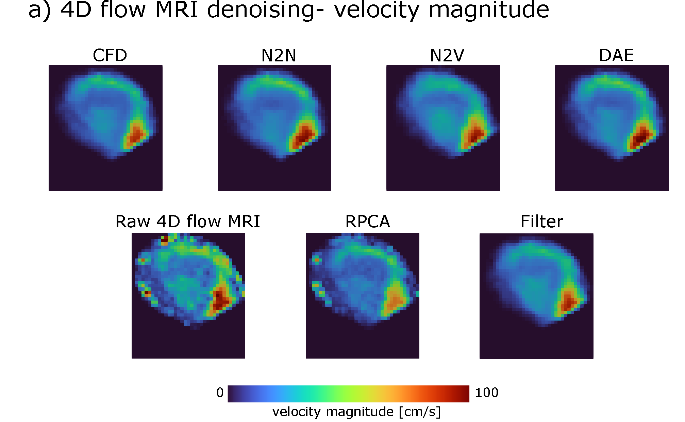

# ML_4Dflow

This repository contains the python codes for the following paper:

**A comparison of machine learning methods for recovering noisy and missing 4D flow MRI data**

**Hunor Csala, Omid Amili, Roshan D'Souza, Amirhossein Arzani**

International Journal for Numerical Methods in Biomedical Engineering: [https://doi.org/10.1002/cnm.3858](https://doi.org/10.1002/cnm.3858)

___

___

Python and PyTorch codes are included for the following cases:
* Filling in missing data - synthetic imputation
    * itSVD
    * softImpute
    * PPCA
    * Autoencoder
* Denoising noisy data 
    * Synthetic data denoising
    * 4D flow MRI denoising
    * Methods:
        * RPCA
        * Denoising Autoencoder (DAE)
        * Noise2Noise (N2N)
        * Noise2Void (N2V)

		
___

Installation:\
The denoising python codes requires the following packages to be installed before running the codes:

* fancyimpute (for itSVD and softImpute)\
https://pypi.org/project/fancyimpute/

* vtk (for handling vtk input and output data files)\
https://vtk.org/download/
    * Anaconda installation: https://anaconda.org/conda-forge/vtk

* matplotlib (for visualization only)\
https://anaconda.org/conda-forge/matplotlib

* pytorch (for the deep learning methods - DAE, N2N)\
https://pytorch.org/get-started/locally/

The N2V the implementation was taken from: https://github.com/juglab/PPN2V

The RPCA implementation was taken from: https://github.com/dganguli/robust-pca

___
  
